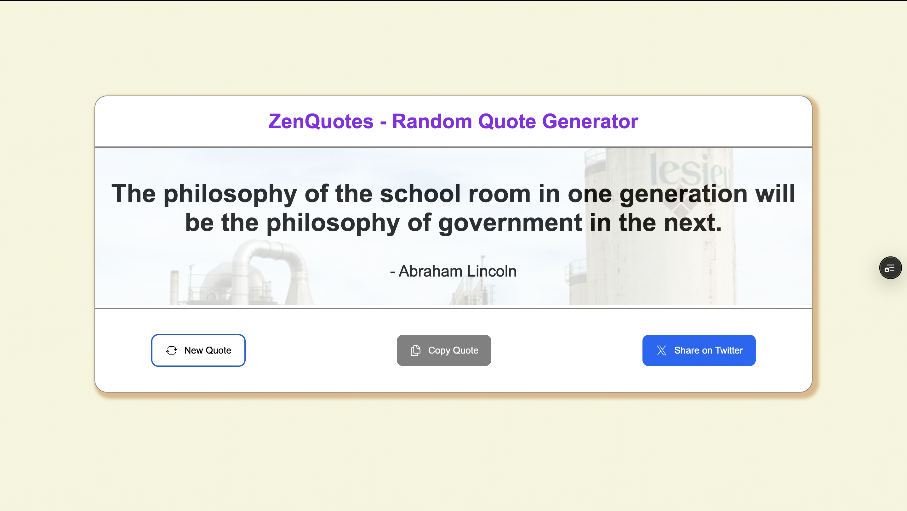

# ZenQuotes - Random Quote Generator

## Application Features:

-   The website shows the random quote and the author name on the display when the user visits the website.
-   The New Quote button generates a new quote and displays the quote to the user.
-   There is a Copy to clipboard button which can be used to copy the quote and can be pasted wherever the user wants to use the quote.
-   The Share on Twitter button can be used to share the quote and the author name on twitter.
-   A random image also generates while the website has loaded just like the ranodm quote is generated.

## Screenshots:

## Deployment Link:

https://zen-quotes-ten.vercel.app/
